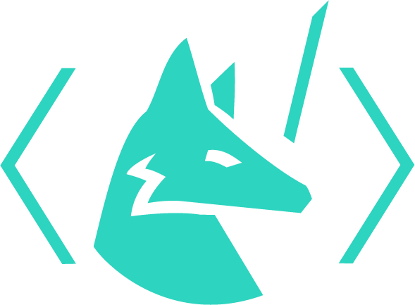
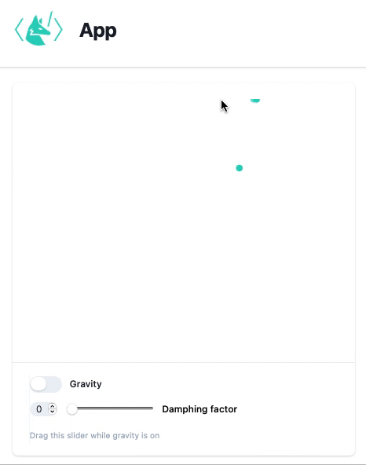

# Wolfram Language XML



*A syntax extension for Wolfram Language that lets you write HTML markup inside a Wolfram Language Script similar to JSX. A successor of [JerryI/WSP](https://github.com/JerryI/wl-wsp).*

Open-source and free (together with Wolfram Engine)

---

__See [DOCS](https://jerryi.github.io/wlx-docs/)__ 💫


---


WLX produces regular Wolfram Expressions, that can be used to make components, building blocks for GUI, and advanced data representation using modern tools like HTML/CSS and Javascript

```jsx
Heading[Text_] := <h2 class="tracking-tight"><Text/></h2>;

<body>                                   
    <Heading>
        Hello World
    </Heading>
</body>
```

Combinning it together with [WLJS Interpreter](https://github.com/JerryI/wljs-interpreter) and [HTTP server](https://github.com/KirillBelovTest/HTTPHandler), one can make quite complicated web-aplications like this one



## Installation / Usage / Syntax
__See [DOCS](https://jerryi.github.io/wlx-docs/)__

## License
GNU GPLv3


